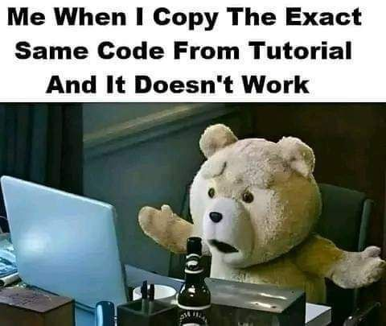

<h1 align="center">
<strong>AUT_AP_2025_Spring Homework 2</strong>
</h1>

<p align="center">
<strong> Deadline: 3th of Esfand - 23:59 o'clock</strong>
</p>

# **1st Question: Variadic Template Sum (with String-Based Numbers)**

## **Objective**

Implement a function template `sum` that accepts any number of arguments of different types (**integers, floating points, and string-based numbers**) and returns their sum.

This exercise will reinforce your understanding of **variadic templates**, **parameter packs**, **type conversion**, and **compile-time recursion or fold expressions**.

## **Task Details**

-   Use **template parameter packs** to allow an arbitrary number of arguments.
-   Ensure the function can handle a mix of:
    -   **Integer values** (`int`, `long`, etc.)
    -   **Floating-point numbers** (`float`, `double`)
    -   **String-based numbers** (`std::string`) that contain valid numeric values (e.g., `"42"`, `"3.14"`).
-   Convert string-based numbers to numeric values before summation.
-   Use **SFINAE (`std::enable_if`) or C++20 concepts** to ensure only valid numerical inputs are processed.
-   Optional: Optimize performance by utilizing std::string_view where appropriate to avoid unnecessary string copies.

## **Example Usage**

```cpp
std::cout << sum(1, 2.5, 3, "4.5") << std::endl;  // Output: 11
std::cout << sum("10", 20, "30") << std::endl;    // Output: 60
std::cout << sum(3.14, "2.86") << std::endl;      // Output: 6
```

# **2nd Question: Word Frequency**

## **Objective**

Develop a function that counts the frequency of words in a given text string efficiently.

This exercise will improve your skills in **text processing**, **C++ Standard Library containers**.

## **Task Details**

-   Use `std::map<std::string, int>` to store word frequencies.
-   Ensure that the function correctly handles punctuation and case sensitivity.

## **Example Usage**

```cpp
std::string text = "Hello world! This is a test. hello again, world.";
std::map<std::string, int> wordCounts = countWords(text);

for (const auto& [word, count] : wordCounts) {
    std::cout << word << " -> " << count << '\n';
}

// Expected output:
// hello -> 2
// world -> 2
// this -> 1
// is -> 1
// a -> 1
// test -> 1
// again -> 1
```

# **Final Step: How To Test Your Program**

If you want to debug your code, set the `if` statement to `true`. This will allow you to place your debugging code in the designated section. Once you're done with the debugging process, remember to set the `if` statement back to `false` to test your program using the provided `unit-test.cpp`.

```cpp
#include <iostream>
#include <gtest/gtest.h>

#include "Q1_Variadic_Template_sum.h"
#include "Q2_Word_Frequency.h"


int main(int argc, char **argv)
{
    if (true) // Set to false to run unit-tests
    {
        // Debug section: Place your debugging code here
    }
    else
    {
        ::testing::InitGoogleTest(&argc, argv);
        std::cout << "RUNNING TESTS ..." << std::endl;
        int ret{RUN_ALL_TESTS()};
        if (!ret)
            std::cout << "<<<SUCCESS>>>" << std::endl;
        else
            std::cout << "FAILED" << std::endl;
    }
    return 0;
}
```

<p align="center">
  
</p>

**Best Regards, [Afi](https://github.com/aaafi)**
